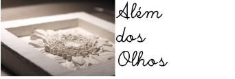

                                            
# O que é o projeto Além dos Olhos?
Projeto open source para criação de modelos 3D a partir de imagens, usando placas de desenvolvimento que possibilitem processamento de imagens na ponta.

# Objetivo
Temos como objetivo a criação de uma máquina fotográfica que gere arquivos tanto da imagem 2D como da imagem a ser esculpida ou impressa em 3D. Para isso queremos criar/melhorar os algoritmos de processamento de imagens que geram modelos 3D e aplicá-los em placas de desenvolvimento como Raspberry Pi, UP Square etc.

# Como surgiu o projeto?
Este projeto foi desenvolvido para possibilitar fotografias acessíveis a pessoas com deficiência visual. Desenvolvemos uma oficina de fotografia para um grupo de pessoas cegas e baixa visão, o resultado dessa oficina foi traduzido para obras em relevo. Visamos que o desenvolvimento da leitura de imagem dê liberdade ao leitor cego para que ele consiga compreender as imagens a partir de suas referências e não somente por uma áudio descrição. Conjuntamente estimular a inclusão, não só desse grupo como também outros grupos minoritários no âmbito da fotografia.

 

# Resultados
* Realização da Oficina de fotografia para um grupo de pessoas cegas e baixa visão
* Modelagem utilizado técnicas de fotométria para obter uma malha bruta que foi refinada posteriormente no Zbrush
* A confecção das peças foi feita na Fresadora CNC, ferramenta que nos permitiu dar as peças a maior quantidade de detalhes como gostaríamos, neste processo o [L.O.U.Co - Laboratório de Objetos Urbanos Conectados](https://www.instagram.com/portodigitalouco/) foi fundamental.
* Realizamos uma [exposição](https://www.behance.net/gallery/70063129/Alm-dos-Olhos) no Apolo 235, localizado no Porto Digital.

 

# Materiais de Apoio

| Título  |  Tópico  | Link de acesso |
| ------------------- | ------------------- | ------------------- |
|  Célula de conteúdo |  Algoritmo |  Célula de conteúdo |
|  Célula de conteúdo |  Camera |  Célula de conteúdo |

## Autores
* Arlindo Gomes
* Cristiana Soares
* Laís Bandeira
